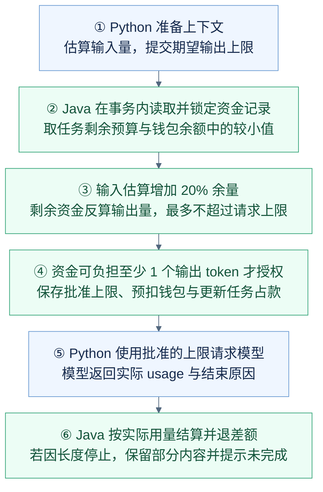

# 方案 A：按可用资金批准输出上限

```mermaid
%%{init: {"theme":"base","fontFamily":"Arial, sans-serif","themeVariables":{"fontSize":"20px","fontFamily":"Arial, sans-serif","primaryColor":"#eff6ff","primaryTextColor":"#172b4d","primaryBorderColor":"#6b9bd2","lineColor":"#52677e","edgeLabelBackground":"#ffffff"},"flowchart":{"htmlLabels":false,"curve":"linear","wrappingWidth":540,"rankSpacing":24,"padding":18}}}%%
flowchart TB
    request["① Python 准备上下文<br/>估算输入量，提交期望输出上限"]
    funds["② Java 在事务内读取并锁定资金记录<br/>取任务剩余预算与钱包余额中的较小值"]
    limit["③ 输入估算增加 20% 余量<br/>剩余资金反算输出量，最多不超过请求上限"]
    reserve["④ 资金可负担至少 1 个输出 token 才授权<br/>保存批准上限、预扣钱包与更新任务占款"]
    provider["⑤ Python 使用批准的上限请求模型<br/>模型返回实际 usage 与结束原因"]
    settle["⑥ Java 按实际用量结算并退差额<br/>若因长度停止，保留部分内容并提示未完成"]
    request --> funds --> limit --> reserve --> provider --> settle
    classDef money fill:#ecfdf5,stroke:#34a478,color:#14543b
    class funds,limit,reserve,settle money
```
