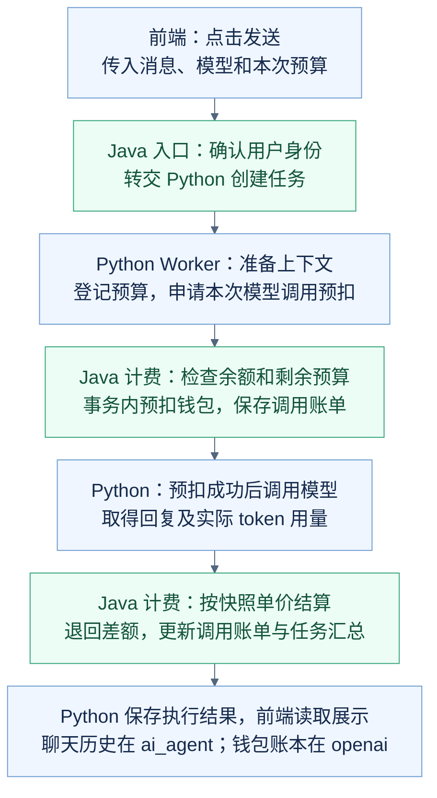

# 谁负责执行，谁负责扣费

```mermaid
%%{init: {"theme":"base","fontFamily":"Arial, sans-serif","themeVariables":{"fontSize":"20px","fontFamily":"Arial, sans-serif","primaryColor":"#eff6ff","primaryTextColor":"#172b4d","primaryBorderColor":"#6b9bd2","lineColor":"#52677e","edgeLabelBackground":"#ffffff"},"flowchart":{"htmlLabels":false,"curve":"linear","wrappingWidth":520,"rankSpacing":24,"padding":18}}}%%
flowchart TB
    user["前端：点击发送<br/>传入消息、模型和本次预算"]
    proxy["Java 入口：确认用户身份<br/>转交 Python 创建任务"]
    worker["Python Worker：准备上下文<br/>登记预算，申请本次模型调用预扣"]
    reserve["Java 计费：检查余额和剩余预算<br/>事务内预扣钱包，保存调用账单"]
    provider["Python：预扣成功后调用模型<br/>取得回复及实际 token 用量"]
    settle["Java 计费：按快照单价结算<br/>退回差额，更新调用账单与任务汇总"]
    result["Python 保存执行结果，前端读取展示<br/>聊天历史在 ai_agent；钱包账本在 openai"]
    user --> proxy --> worker --> reserve --> provider --> settle --> result
    classDef java fill:#ecfdf5,stroke:#34a478,color:#14543b
    classDef python fill:#eff6ff,stroke:#6b9bd2,color:#172b4d
    class proxy,reserve,settle java
    class worker,provider python
```
