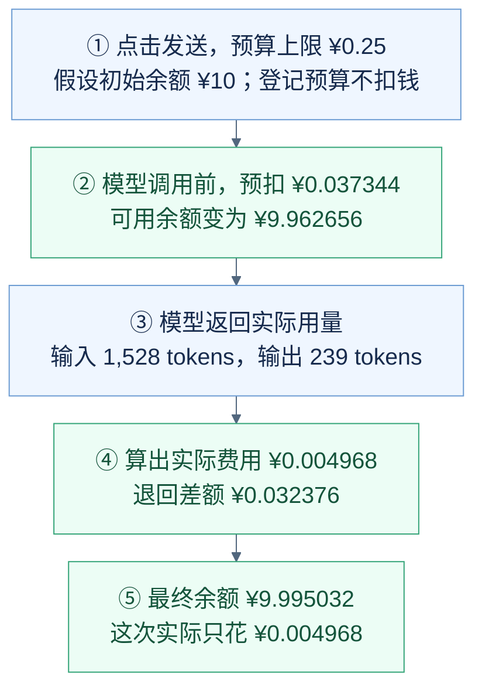

# 一次模型调用：先预扣，后退差额

```mermaid
%%{init: {"theme":"base","fontFamily":"Arial, sans-serif","themeVariables":{"fontSize":"20px","fontFamily":"Arial, sans-serif","primaryColor":"#eff6ff","primaryTextColor":"#172b4d","primaryBorderColor":"#6b9bd2","lineColor":"#52677e","edgeLabelBackground":"#ffffff"},"flowchart":{"htmlLabels":false,"curve":"linear","wrappingWidth":520,"rankSpacing":24,"padding":18}}}%%
flowchart TB
    start["① 点击发送，预算上限 ¥0.25<br/>假设初始余额 ¥10；登记预算不扣钱"]
    hold["② 模型调用前，预扣 ¥0.037344<br/>可用余额变为 ¥9.962656"]
    usage["③ 模型返回实际用量<br/>输入 1,528 tokens，输出 239 tokens"]
    settle["④ 算出实际费用 ¥0.004968<br/>退回差额 ¥0.032376"]
    finish["⑤ 最终余额 ¥9.995032<br/>这次实际只花 ¥0.004968"]
    start --> hold --> usage --> settle --> finish
    classDef money fill:#ecfdf5,stroke:#34a478,color:#14543b
    class hold,settle,finish money
```
