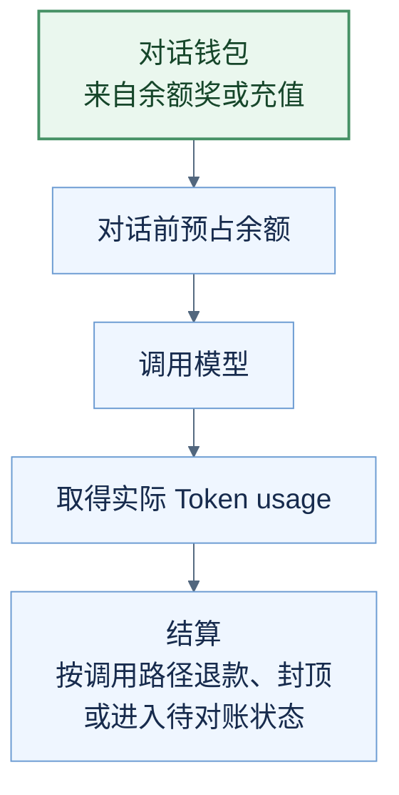

# 4.3 对话：预占余额，按实际用量结算

```mermaid
%%{init: {"theme": "base", "themeVariables": {"fontSize": "20px", "fontFamily": "Arial, sans-serif", "primaryColor": "#eff6ff", "primaryTextColor": "#172b4d", "primaryBorderColor": "#6b9bd2", "lineColor": "#52677e", "edgeLabelBackground": "#ffffff"}, "flowchart": {"htmlLabels": false, "curve": "linear", "nodeSpacing": 30, "rankSpacing": 35, "padding": 16}, "fontFamily": "Arial, sans-serif"}}%%
flowchart TB
  Wallet["对话钱包<br/>来自余额奖或充值"] --> Hold["对话前预占余额"]
  Hold --> Model["调用模型"]
  Model --> Usage["取得实际 Token usage"]
  Usage --> Settle["结算<br/>按调用路径退款、封顶<br/>或进入待对账状态"]
  classDef wallet fill:#eaf7ee,stroke:#469165,color:#16462a,stroke-width:2px;
  class Wallet wallet;
```
