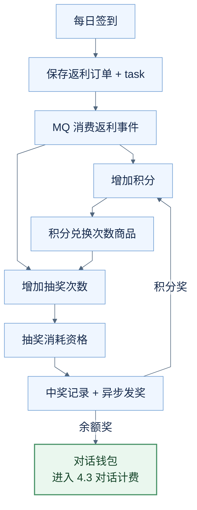

# 4.1 签到与抽奖：获得积分、次数和余额

```mermaid
%%{init: {"theme": "base", "themeVariables": {"fontSize": "20px", "fontFamily": "Arial, sans-serif", "primaryColor": "#eff6ff", "primaryTextColor": "#172b4d", "primaryBorderColor": "#6b9bd2", "lineColor": "#52677e", "edgeLabelBackground": "#ffffff"}, "flowchart": {"htmlLabels": false, "curve": "linear", "nodeSpacing": 30, "rankSpacing": 35, "padding": 16}, "fontFamily": "Arial, sans-serif"}}%%
flowchart TB
  Sign["每日签到"] --> Rebate["保存返利订单 + task"]
  Rebate --> Queue["MQ 消费返利事件"]
  Queue --> Points["增加积分"]
  Queue --> Quota["增加抽奖次数"]
  Points --> Exchange["积分兑换次数商品"]
  Exchange --> Quota
  Quota --> Draw["抽奖消耗资格"]
  Draw --> Award["中奖记录 + 异步发奖"]
  Award -->|积分奖| Points
  Award -->|余额奖| Wallet["对话钱包<br/>进入 4.3 对话计费"]
  classDef wallet fill:#eaf7ee,stroke:#469165,color:#16462a,stroke-width:2px;
  class Wallet wallet;
```
