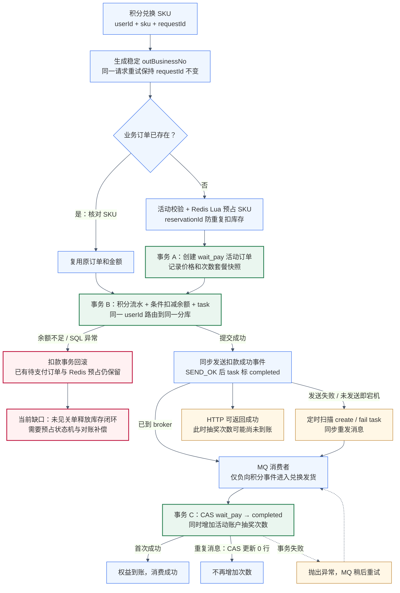

# 积分兑换与数据一致性

基于当前 big-market 工作区代码。绿色为本地事务，红色为尚未闭环的失败窗口。

```mermaid
%%{init: {"theme":"base","themeVariables":{"fontFamily":"Arial, sans-serif","fontSize":"17px","primaryColor":"#eff6ff","primaryBorderColor":"#2563eb","lineColor":"#475569"},"flowchart":{"curve":"basis","nodeSpacing":30,"rankSpacing":42,"wrappingWidth":310}}}%%
flowchart TB
    Request["积分兑换 SKU<br/>userId + sku + requestId"] --> Key["生成稳定 outBusinessNo<br/>同一请求重试保持 requestId 不变"]
    Key --> Existing{"业务订单已存在？"}
    Existing -->|是：核对 SKU| Reuse["复用原订单和金额"]
    Existing -->|否| Check["活动校验 + Redis Lua 预占 SKU<br/>reservationId 防重复扣库存"]
    Check --> Order["事务 A：创建 wait_pay 活动订单<br/>记录价格和次数套餐快照"]
    Reuse --> Debit
    Order --> Debit["事务 B：积分流水 + 条件扣减余额 + task<br/>同一 userId 路由到同一分库"]
    Debit -->|提交成功| Publish["同步发送扣款成功事件<br/>SEND_OK 后 task 标 completed"]
    Debit -->|余额不足 / SQL 异常| Leak["扣款事务回滚<br/>已有待支付订单与 Redis 预占仍保留"]
    Leak --> Gap["当前缺口：未见关单释放库存闭环<br/>需要预占状态机与对账补偿"]
    Publish -->|已到 broker| Consumer["MQ 消费者<br/>仅负向积分事件进入兑换发货"]
    Publish -->|发送失败 / 未发送即宕机| TaskJob["定时扫描 create / fail task<br/>同步重发消息"]
    TaskJob --> Consumer
    Consumer --> Fulfill["事务 C：CAS wait_pay → completed<br/>同时增加活动账户抽奖次数"]
    Fulfill -->|首次成功| Done["权益到账，消费成功"]
    Fulfill -->|重复消息：CAS 更新 0 行| Noop["不再增加次数"]
    Fulfill -.->|事务失败| Retry["抛出异常，MQ 稍后重试"]
    Retry -.-> Consumer
    Publish --> Response["HTTP 可返回成功<br/>此时抽奖次数可能尚未到账"]
    classDef tx fill:#eaf6ef,stroke:#298052,stroke-width:2px;
    classDef retry fill:#fff7e6,stroke:#b7791f;
    classDef gap fill:#fff1f2,stroke:#be123c,stroke-width:2px;
    class Order,Debit,Fulfill tx;
    class TaskJob,Response,Retry retry;
    class Leak,Gap gap;
```
